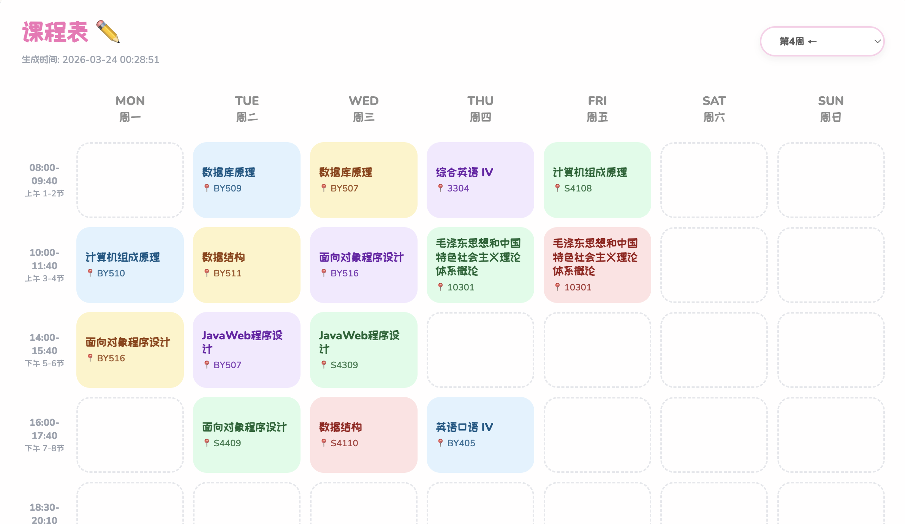
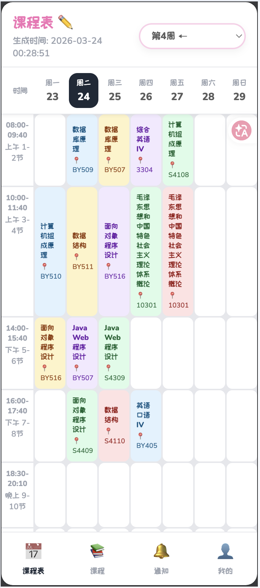

# HUE Timetable

一个为 HUE 教务系统设计的轻量课表查看器：
后端使用 Flask 登录教务系统并实时拉取课表，前端以卡片化网格展示，支持个人课表链接、按周筛选，并在周末自动跳转到下一周。




---

## 项目亮点

- 实时获取：每次刷新页面都会重新拉取教务系统数据
- 个人链接：登录后生成专属课表链接，后续可直接访问
- 安全存储：密码使用 Fernet 加密后保存到本地 SQLite
- 智能周次：根据开学日期自动计算当前周
- 周末优化：周末访问可自动展示下一周课表
- 课程聚合：同一时间段多门课程可并排展示
- 移动端适配：包含移动端日期条与底部导航样式
- 环境配置：账号、密码、公开链接和密钥可通过 `.env` 配置

## 技术栈

- Python / Flask
- requests
- BeautifulSoup4 + lxml
- ddddocr（验证码识别）
- Pillow
- cryptography
- python-dotenv
- HTML + CSS + Vanilla JavaScript

## 目录结构

```text
HUE-Timetable/
├─ app.py                    # Flask 应用入口
├─ config.py                 # 基础配置与环境变量读取
├─ .env.example              # 环境变量模板
├─ requirements.txt          # Python 依赖
├─ static/
│  ├─ css/style.css          # 页面样式
│  ├─ js/script.js           # 前端交互逻辑
│  ├─ fonts/                 # 字体资源
│  └─ logo.png               # 站点图标
├─ templates/
│  ├─ index.html             # 首页
│  ├─ login.html             # 登录页
│  └─ timetable.html         # 课表页
├─ tests/                    # 自动化测试
└─ utils/
   ├─ crawler.py             # 登录与课表抓取
   ├─ parser.py              # 课表与周次解析
   ├─ credential_store.py    # 本地凭据存储
   ├─ crypto.py              # 密码加密/解密
   └─ token_generator.py     # 个人链接 token 生成
```

## 快速开始

### 1. 克隆并进入项目

```bash
git clone https://github.com/QingShuishui/HUE-Timetable.git
cd HUE-Timetable
```

### 2. 创建虚拟环境并安装依赖

```bash
python3 -m venv .venv
source .venv/bin/activate
pip install -r requirements.txt
```

### 3. 配置账号信息

复制环境变量模板：

```bash
cp .env.example .env
```

生成密码加密密钥：

```bash
python -c "from cryptography.fernet import Fernet; print(Fernet.generate_key().decode())"
```

编辑 `.env`：

```env
USERNAME=你的学号
PASSWORD=你的教务系统密码
BASE_URL=https://jwxt.hue.edu.cn
PUBLIC_BASE_URL=http://localhost:5004
KCBPRO_DB_PATH=kcbpro.db
CREDENTIAL_ENCRYPTION_KEY=上一步生成的Fernet密钥
```

说明：

- `.env` 只用于本地运行，已经加入 `.gitignore`，不要提交真实账号密码。
- `config.py` 会从 `.env` 读取 `USERNAME` 和 `PASSWORD`。
- 登录页也支持直接输入账号密码，登录成功后会生成个人课表链接。

### 4. 启动服务

```bash
python app.py
```

浏览器访问：

```text
http://localhost:5004
```

## API 说明

### `POST /login`

提交教务系统账号密码，登录成功后生成个人课表链接。

### `GET /t/<token>`

访问个人课表页面。

### `GET /api/schedule/<token>`

获取课表数据（JSON）。

#### 查询参数

- `week`：周次（如 `1`、`2`、`current`、`all`）
- `is_weekend`：`true/false`，用于周末自动跳转逻辑

#### 返回字段（简化）

- `semester_info`：学期信息
- `generated_at`：生成时间
- `grid`：按 `row-col` 组织的课程网格
- `current_week`：当前周
- `selected_week`：当前筛选周
- `weekend_message`：周末提示信息

### `GET /api/tokens/<token>/settings`

获取个人链接的账号、密码、开学日期和保存链接。

### `PATCH /api/tokens/<token>/settings`

更新个人链接的账号、密码和开学日期。

## 配置项说明

`.env` 主要配置：

- `USERNAME` / `PASSWORD`：教务系统登录账号
- `BASE_URL`：教务系统根地址
- `PUBLIC_BASE_URL`：部署后的公开访问地址，用于生成可保存链接
- `KCBPRO_DB_PATH`：SQLite 数据库路径
- `CREDENTIAL_ENCRYPTION_KEY`：密码加密密钥

`config.py` 主要配置：

- `SEMESTER_START_DATE`：用于计算当前周次
- `TIME_SLOTS`：时间段展示文本
- `WEEKDAYS`：星期展示文本
- `HOST` / `PORT` / `DEBUG`：Flask 启动参数

## 测试

```bash
pytest
```

## 常见问题

### 1. 登录失败

- 检查 `USERNAME` 和 `PASSWORD` 是否正确
- 学校教务系统可能临时不可用，请稍后重试
- 若验证码识别连续失败，可多刷新几次

### 2. 启动时报 `CREDENTIAL_ENCRYPTION_KEY` 相关错误

- 确认已经复制 `.env.example` 为 `.env`
- 确认 `.env` 中的 `CREDENTIAL_ENCRYPTION_KEY` 是 Fernet 密钥
- 不要随意更换密钥，否则旧数据库中已保存的密码将无法解密

### 3. 依赖安装报错

可先升级 pip 再安装：

```bash
python -m pip install --upgrade pip
pip install -r requirements.txt
```

### 4. 端口被占用

修改 `config.py` 中的 `PORT`（例如改为 `5005`）后重启。

## 安全建议

- 不要将真实账号密码提交到仓库
- 不要提交 `.env`、`kcbpro.db`、日志文件和缓存目录
- 如果曾经把真实账号密码提交到远程仓库，请尽快修改密码并清理 Git 历史
